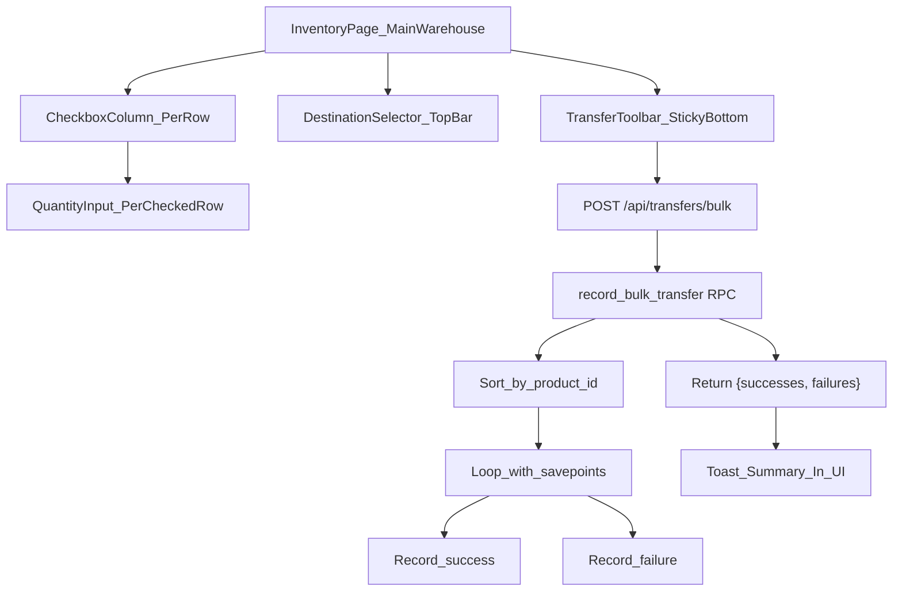

# Bulk Transfer Revamp

## Current State

- Transfers are one-at-a-time: click a row, fill in destination/quantity/note, submit
- Dedicated `/transfers` page exists but will be removed
- API handles single transfers via `POST /api/transfers` calling `record_transfer` RPC

## Architecture




## Changes

### 1. Database Migration: `record_bulk_transfer` RPC

Create `[database/migrations/008_bulk_transfer.sql](database/migrations/008_bulk_transfer.sql)`

New PostgreSQL function with these safety features:

- **Input:** `p_from_warehouse_id UUID, p_to_warehouse_id UUID, p_items JSONB, p_note TEXT, p_user_id UUID`
  - `p_items` is a JSON array: `[{"product_id": "...", "quantity": 5}, ...]`
- **Deduplication:** Aggregates duplicate product_ids (sums quantities) before processing
- **Batch limit:** Raises exception if item count exceeds 100
- **Sorted locking:** Sorts items by `product_id` before processing to prevent deadlocks
- **Per-item savepoints:** Uses `BEGIN...EXCEPTION` blocks inside the loop so one failure does not roll back others
- **Returns:** `TABLE(product_id UUID, success BOOLEAN, error_message TEXT, transfer_out_id UUID, transfer_in_id UUID)`

Key logic per item inside the loop:

1. `SELECT ... FOR UPDATE` on source inventory row (locks in consistent order)
2. Check stock >= requested quantity
3. Decrement source, increment/create destination
4. Insert TRANSFER_OUT and TRANSFER_IN transaction records
5. On exception: record failure, continue to next item

### 2. New Bulk Transfer API Endpoint

Create `[frontend/src/app/api/transfers/bulk/route.ts](frontend/src/app/api/transfers/bulk/route.ts)`

- Accept `{ from_warehouse_id, to_warehouse_id, items: [{product_id, quantity}], reference_note? }`
- Validate admin access, warehouse existence, basic field presence, and batch size <= 100
- Single RPC call to `record_bulk_transfer`
- Return HTTP 200 with structured response:

```typescript
{
  success: true,          // true if ANY item succeeded
  total: 10,
  succeeded: 8,
  failed: 2,
  results: [
    { product_id: "...", success: true, transfer_out_id: "...", transfer_in_id: "..." },
    { product_id: "...", success: false, error: "Insufficient stock: 3 available, 5 requested" }
  ]
}
```

### 3. API Client Update

In `[frontend/src/lib/api.ts](frontend/src/lib/api.ts)`, add:

```typescript
async createBulkTransfer(data: {
  from_warehouse_id: string;
  to_warehouse_id: string;
  items: { product_id: string; quantity: number }[];
  reference_note?: string;
})
```

### 4. Inventory Page Revamp

Rewrite the Main Warehouse transfer UI in `[frontend/src/app/(dashboard)/inventory/page.tsx](frontend/src/app/(dashboard)/inventory/page.tsx)`:

**New state:**

- `selectedItems: Map<string, number>` -- maps product_id to transfer quantity (replaces the single-item transfer state)
- `transferDestination: string` -- destination warehouse
- `transferNote: string` -- shared note for the batch

**Table changes (when Main Warehouse is selected):**

- Add a **checkbox column** (leftmost) on each row that has stock > 0
- Add a **quantity input column** (after the existing Quantity column) -- only editable when the row is checked
- Quantity defaults to 1 when checked, max is `quantity_on_hand`
- Remove the expand-to-transfer row interaction (keep expand-to-sell for partner warehouses)
- Add a "select all" checkbox in the header

**Transfer toolbar (sticky at bottom of page, visible when items are selected):**

- Shows count of selected items (e.g., "5 items selected")
- Destination warehouse dropdown
- Optional note field
- "Transfer X Items" button
- "Clear Selection" button

**Submission flow:**

- Call `api.createBulkTransfer(...)` with all selected items
- On response, show toast summary:
  - All success: "Successfully transferred 5 items to CarProofing"
  - Partial: "3 of 5 transfers succeeded. Failed: Product X (insufficient stock), Product Y (error)"
- Clear selection and invalidate inventory queries on any success
- Highlight failed items in red so the user can retry

### 5. Remove Dedicated Transfers Page

- Delete `[frontend/src/app/(dashboard)/transfers/page.tsx](frontend/src/app/(dashboard)/transfers/page.tsx)`
- Remove "Transfers" nav entry from `[frontend/src/components/layout/Sidebar.tsx](frontend/src/components/layout/Sidebar.tsx)` (line 101)
- Remove "Transfers" nav entry from `[frontend/src/components/layout/MobileNav.tsx](frontend/src/components/layout/MobileNav.tsx)` (line 120)

### 6. Cleanup

- Remove old single-transfer state variables (`transferQuantity`, `transferDestination`, `transferNote`, `expandedRowId` transfer logic) from the inventory page
- Keep the sale expand-row logic intact for partner warehouses
- Keep the existing single `POST /api/transfers` endpoint (no breaking change, just unused by the UI)

## Key Design Decisions

- **New `record_bulk_transfer` RPC** handles all risk mitigation at the database level: sorted locking (deadlock prevention), savepoints (partial success), deduplication, and batch size limits. Single network round-trip.
- **Checkbox + inline quantity input** keeps the user in the table context without modals or separate panels.
- **Sticky bottom toolbar** provides clear call-to-action without scrolling, similar to a "shopping cart" pattern.
- **Partner warehouses keep the sale expand-row UX** -- only Main Warehouse gets the bulk transfer checkboxes.
- **Old single-transfer endpoint is preserved** for backward compatibility (scripts, future integrations).

