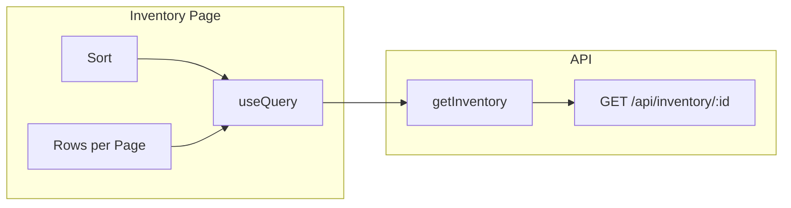

# Inventory Table: Sort by Quantity + Page Size Options

## Overview

Add (1) a sort-by-quantity filter and (2) page size options (50, 100, 200) to the inventory table.

## Current State

- **Inventory page** ([`frontend/src/app/(dashboard)/inventory/page.tsx`](frontend/src/app/(dashboard)/inventory/page.tsx)): Paginated inventory (fixed 50 items per page), search and brand filter. Data from `api.getInventory()`.
- **Inventory API** ([`frontend/src/app/api/inventory/[warehouseId]/route.ts`](frontend/src/app/api/inventory/[warehouseId]/route.ts)): Accepts `page_size` and applies filters. No `.order()` — rows in undefined order.
- **API client** ([`frontend/src/lib/api.ts`](frontend/src/lib/api.ts)): `getInventory()` accepts `page`, `limit`, `search`, `brand` — no sort param.

---

## Feature 1: Sort by Quantity

### API

**File:** `frontend/src/app/api/inventory/[warehouseId]/route.ts`

- Read `sort = searchParams.get("sort")`.
- Before `.range()`, apply ordering:
  - `quantity_asc` → `.order("quantity_on_hand", { ascending: true }).order("product_id")`
  - `quantity_desc` → `.order("quantity_on_hand", { ascending: false }).order("product_id")`
- Omit or invalid `sort` → no explicit order.

### API client

**File:** `frontend/src/lib/api.ts`

- Add optional `sort?: "quantity_asc" | "quantity_desc"` to `getInventory()` options.
- Append `sort` to `URLSearchParams` when provided.

### UI

**File:** `frontend/src/app/(dashboard)/inventory/page.tsx`

- State: `const [sort, setSort] = useState<string>("default")`.
- Add Select next to brand filter:
  - Default
  - Quantity: Low to High (`quantity_asc`)
  - Quantity: High to Low (`quantity_desc`)
- Include `sort` in `queryKey`; pass to `api.getInventory()` when not `"default"`.
- Reset `currentPage` to 1 when `sort` changes.

---

## Feature 2: Page Size Options (50, 100, 200)

### API

**File:** `frontend/src/app/api/inventory/[warehouseId]/route.ts`

- Cap `page_size` to prevent abuse: `Math.min(parseInt(...) || 50, 200)`.
- API already reads `page_size`; no other changes needed.

### UI

**File:** `frontend/src/app/(dashboard)/inventory/page.tsx`

- Replace `const pageSize = 50` with state: `const [pageSize, setPageSize] = useState(50)`.
- Add Select for "Rows per page" with options: 50, 100, 200.
- Include `pageSize` in `queryKey`.
- Reset `currentPage` to 1 when `pageSize` changes.
- Use `pageSize` for pagination math (already done) and `api.getInventory(..., { limit: pageSize })`.

---

## UI Layout (header filters)

```
[Search] [Brand ▼] [Sort ▼] [Rows per page ▼] [Warehouse ▼]  (admin only)
```

- **Sort** and **Rows per page** use the same Select pattern as BrandFilter.
- Place both in the flex wrap container with Search and BrandFilter.

---

## Data Flow



---

## Edge Cases

- Invalid `sort` or `page_size` → API falls back to defaults.
- Changing sort or page size → reset to page 1.
- Empty result set → unchanged.
